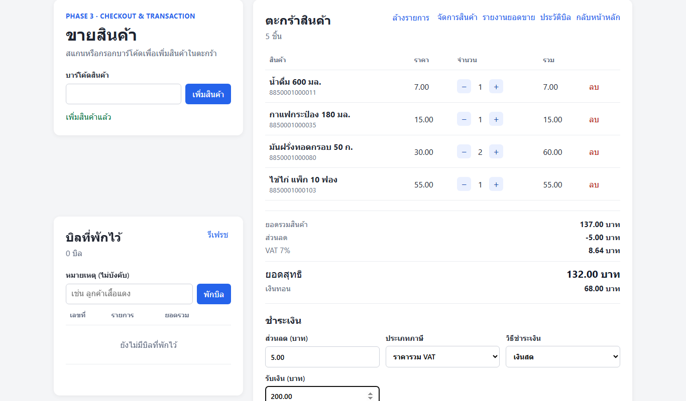
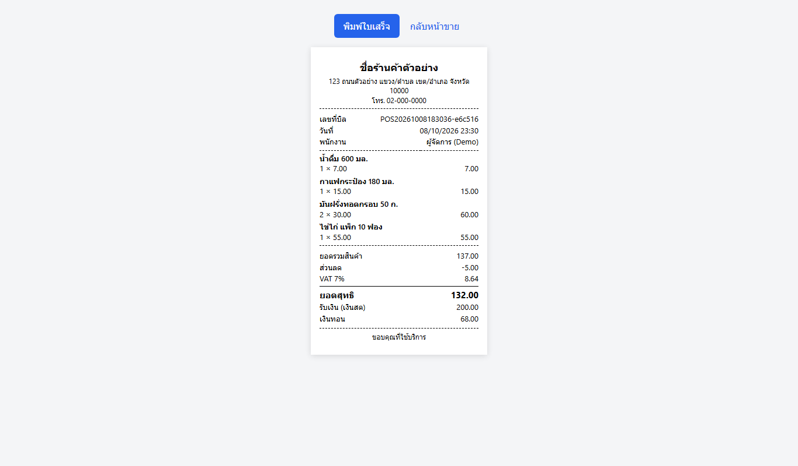
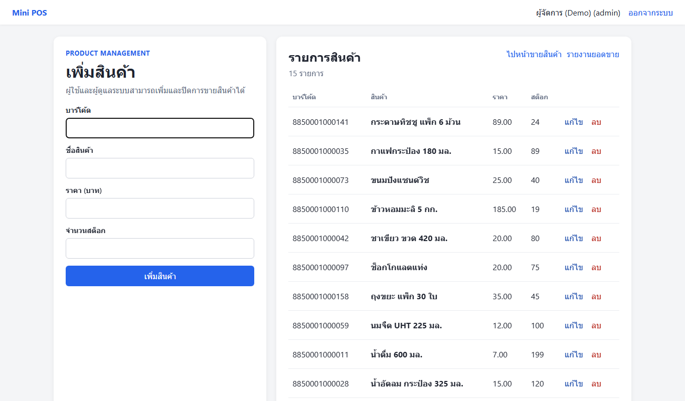
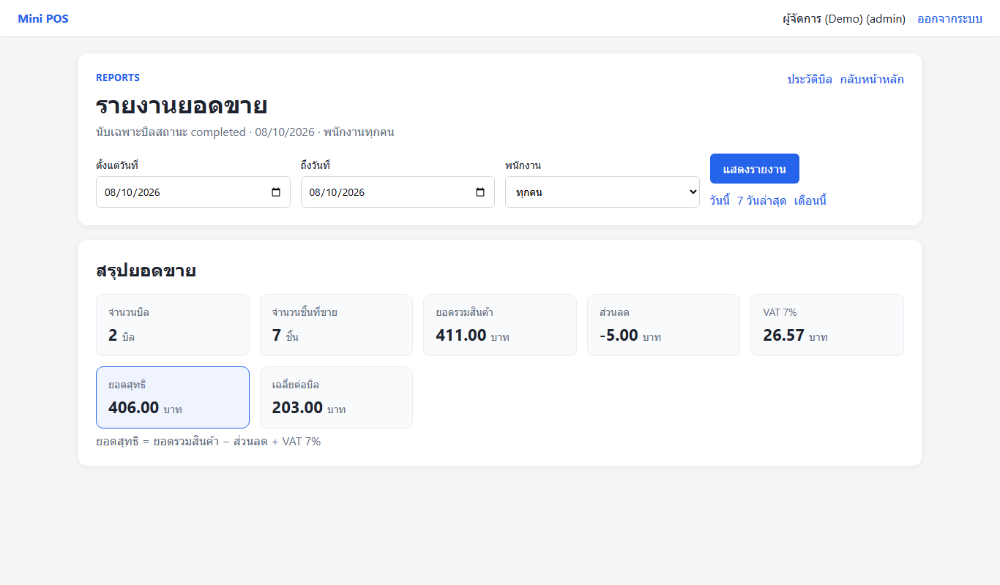
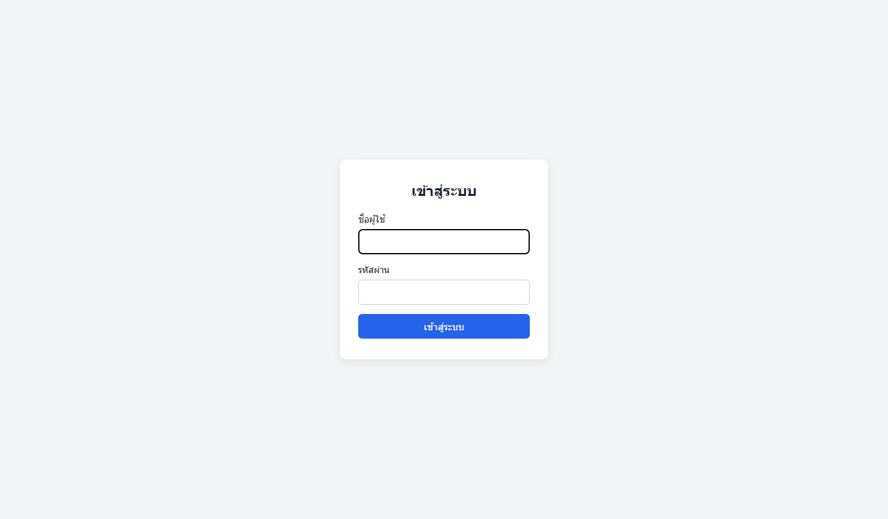
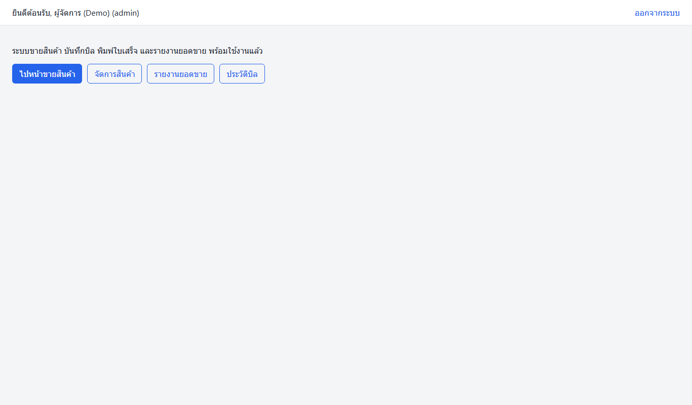
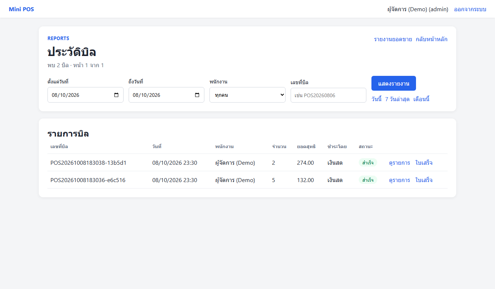

# Mini POS & Billing System

ระบบขายหน้าร้าน (Point of Sale) บนเว็บ เขียนด้วย PHP + MySQL ล้วน ไม่ใช้ framework
รองรับการขายด้วยบาร์โค้ด, คำนวณ VAT 7%, พักบิล, พิมพ์ใบเสร็จ, จัดการสินค้า และรายงานยอดขาย

*A web-based point-of-sale system in plain PHP 8 + MySQL: barcode checkout, 7% VAT, held bills, printable receipts, product management and sales reports.*

## 🔗 Live demo

**https://YOUR-SUBDOMAIN.infinityfreeapp.com** <!-- TODO: ใส่ลิงก์หลัง deploy -->

| บัญชี | รหัสผ่าน | สิทธิ์ |
|---|---|---|
| `demo` | `demo1234` | ผู้จัดการ — เห็นทุกหน้า (รายงาน, ประวัติบิล, จัดการสินค้า) |
| `cashier` | `cashier1234` | พนักงานขาย — หน้าขายอย่างเดียว |

ลองสแกนบาร์โค้ดตัวอย่าง: `8850001000011`, `8850001000035`, `8850001000080`
(ข้อมูลบนเว็บ demo ถูกรีเซ็ตเป็นระยะ)

## ภาพหน้าจอ

| หน้าขาย | ใบเสร็จ |
|---|---|
|  |  |
| **จัดการสินค้า** | **รายงานยอดขาย** |
|  |  |

<details>
<summary>หน้าอื่น ๆ</summary>





</details>

## ฟีเจอร์

- **ขายหน้าร้าน** — สแกน/พิมพ์บาร์โค้ด, ปรับจำนวน, ส่วนลด, VAT 7% (ราคารวม/แยก VAT), รับเงินสด/QR/บัตร, คำนวณเงินทอน
- **ตัดสต็อกแบบปลอดภัย** — ปิดบิลในทรานแซกชันเดียว ล็อกแถวสินค้ากันขายเกินสต็อกเมื่อมีหลายเครื่องขายพร้อมกัน พร้อมบันทึก `stock_movements`
- **พักบิล** — พักตะกร้าไว้ เรียกคืนภายหลังด้วยราคาปัจจุบัน
- **ใบเสร็จ** — พิมพ์ได้ทันทีหลังปิดบิล (CSS สำหรับเครื่องพิมพ์ใบเสร็จ)
- **จัดการสินค้า** — เพิ่ม/แก้ไขในตาราง/ปิดการขาย (admin)
- **รายงานยอดขาย & ประวัติบิล** — กรองตามช่วงวันที่และพนักงาน (admin)
- **ความปลอดภัย** — PDO prepared statements, `password_hash`, CSRF token, แยกสิทธิ์ admin/staff, ไม่แสดงรายละเอียด error ในโหมด production

## เทคโนโลยี

PHP 8 (PDO) · MySQL/MariaDB · HTML/CSS · Vanilla JavaScript (fetch/AJAX) · Playwright (E2E test)

## รันบนเครื่อง

ต้องมี [XAMPP](https://www.apachefriends.org/) (PHP 8 + MySQL) และเพิ่ม `C:\xampp\php`, `C:\xampp\mysql\bin` ลงใน PATH

```bash
start.bat
```

สคริปต์จะเปิด MySQL, สร้างฐานข้อมูล `pos_system` จาก `sql/schema.sql` ถ้ายังไม่มี แล้วเปิดเว็บที่ http://localhost:8000
บัญชีเริ่มต้น: `admin` / `admin1234` (ใส่ข้อมูลตัวอย่างเพิ่มได้จาก `sql/demo_data.sql`)

## ทดสอบ

```bash
cd tests/e2e && npm install && npx playwright install chromium && npm test
```

รายละเอียดใน [tests/e2e/README.md](tests/e2e/README.md)

## Deploy บน shared hosting (เช่น InfinityFree)

```bash
powershell -ExecutionPolicy Bypass -File build_deploy.ps1
```

1. สร้างฐานข้อมูลในแผงควบคุมของโฮสต์ แล้ว import `deploy/pos_hosting.sql` ผ่าน phpMyAdmin
2. คัดลอก `deploy/htdocs/config/env.production.php.example` เป็น `env.production.php` แล้วใส่ค่า DB ของโฮสต์
   (ถ้ามีไฟล์นี้ แอปจะเข้าโหมด production เองโดยไม่ต้องตั้ง `APP_ENV`)
3. อัปทุกอย่างใน `deploy/htdocs/` ขึ้นโฟลเดอร์ `htdocs` ของโฮสต์
4. ล้างข้อมูลที่คนลองเล่นได้ด้วยการ import `deploy/pos_demo_reset.sql`

## เอกสารออกแบบ

- [SYSTEM_DESIGN.md](SYSTEM_DESIGN.md) — ออกแบบฐานข้อมูล, flow การขาย, การคำนวณภาษี
- [PROJECT_MAP.md](PROJECT_MAP.md) — แผนผังไฟล์ในโปรเจกต์
